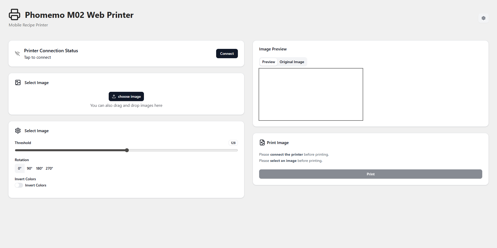

# Phomemo Web Printer

A [Web App](https://k0in.github.io/Phomemo-M02-Web/) for printing to Phomemo printers.

## Supported Printers

- [M02](https://phomemo.com/en-de/products/m02-portable-printer) (only one i own)

## Supported Browsers

Needed Features:

- [Web Serial API](https://caniuse.com/web-serial)

## Usage

## Build locally

1. Clone the repository
2. Install dependencies with `npm install`
3. Start the development server with `npm run dev`
4. Follow the instructions in your console to open the app in your browser.

## Techstack

|name|details|
|---|---|
|[Vue.js](https://vuejs.org/)|Web framework for building user interfaces|
|[Vite](https://vitejs.dev/)|Next Generation Frontend Tooling|
|[Tailwind CSS](https://tailwindcss.com/)|Utility-first CSS framework for rapid UI development|
|[Shadcn/ui](https://ui.shadcn.com/)|A set of components built with Tailwind CSS and Radix UI|
|[TypeScript](https://www.typescriptlang.org/)|A typed superset of JavaScript that compiles to plain JavaScript|
|[Pinia](https://pinia.vuejs.org/)|State management library for Vue.js applications|
|[Comlink](https://www.npmjs.com/package/comlink/v/3.2.0)|A library for creating simple, fast, and efficient web workers (Image parsing code runs of main thread)|

## License

This project is licensed under the MIT License - see the [LICENSE](./LICENSE) file for details.

## Credits

The Printer driver is based on [theacodes python implementation](https://github.com/theacodes/phomemo_m02s).
